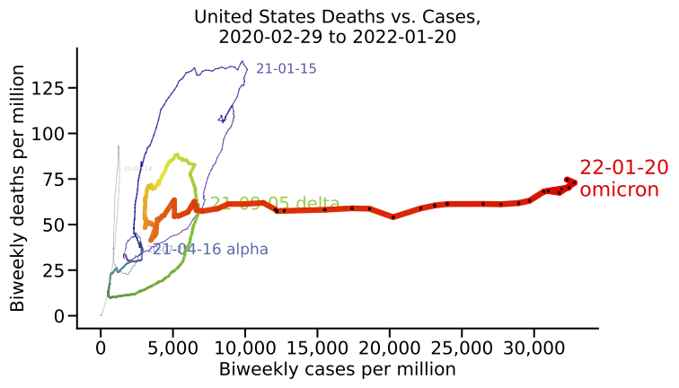
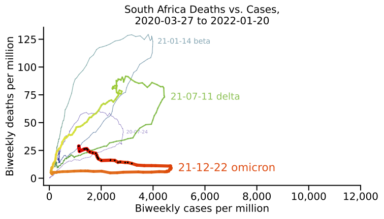

# Visualizing Omicron: COVID-19 Deaths vs. Cases

<a href="https://github.com/rarnaout/Covidcycles/blob/main/covid_deaths_vs_cases.ipynb">Click here for other countries</a>. 

**Countries where omicron has peaked:**

- 2022-01-21: United States
- 2022-01-21: Sweden
- 2022-01-18: Australia
- 2022-01-14: Ireland
- 2022-01-13: Finland
- 2022-01-11: Canada
- 2022-01-10: United Kingdom 

See also this <a href="https://www.researchsquare.com/article/rs-1257935/v1">preprint</a>. 

Cite:

Arnaout, R and Arnaout, R. Visualizing Omicron: COVID-19 Deaths vs. Cases Over Time. 13 January 2022. PREPRINT (Version 1) available at Research Square 
<a href="https://doi.org/10.21203/rs.3.rs-1257935/v1">https://doi.org/10.21203/rs.3.rs-1257935/v1</a>

Data is from <a href="https://github.com/owid/covid-19-data">Our World in Data</a> and <a href="https://covariants.org/per-country/">CoVariants.org</a>. Scroll down for more information.

)

## About this project

For most of the COVID-19 pandemic, the daily focus has been on the number of cases. This still seems to be true as the omicron wave hits.

But omicron on the whole has been much milder. For those who have been recently doubly or triple vaccinated and/or recently infected and are free from underlying comorbidities (of which the list is long), the risk of death is very small. The primary risk of this phase of the pandemic is of those not in the above groups getting sick all at once, overwhelming available hospital beds, while the healthcare workforce is itself depleted as workers quarantine or are at home suffering (usually mild) symptoms.

Here we explore an interesting way to visualize differences in the various waves of the pandemic: plotting deaths as a function of cases. 

**It suggests that omicron is indeed quite different.**

<a href="https://github.com/rarnaout/Covidcycles/blob/main/covid_deaths_vs_cases.ipynb">The notebook shows plots for many countries</a>. The main function should be self-contained enough for you to copy and paste and use to plot data for any country you like.

The data is from https://github.com/owid/covid-19-data, specifically from JHU (public > data > jhu). The usual caveats apply, including completeness from some countries and deaths with vs. of COVID-19 (incidental vs. causative).

Please use as you see fit, as long as it's with attribution.

Ramy Arnaout, MD, DPhil / Boston, MA / January 8, 2022 / rarnaout@bidmc.harvard.edu

## Updates

### January 13, 2022

Set to auto-update daily.

### January 11, 2022

Reran with latest data.

Reordered.

High-res PDFs for each country (feel free to download/use with attribution).

### January 10, 2022

You are welcome to compare 

- variant frequencies: https://covariants.org/per-country
- vaccination rates: https://ourworldindata.org/covid-vaccinations

Added Canada, India, and South Korea.

Some cosmetic tweaks to the plots, and added some options.

