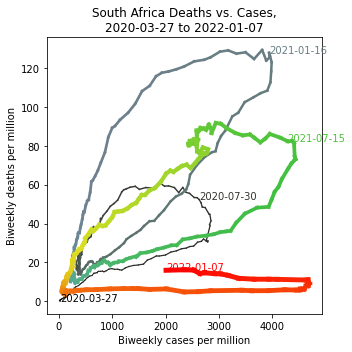

# Visualizing Omicron: COVID-19 Deaths vs. Cases

<a href="https://github.com/rarnaout/Covidcycles/blob/main/covid_deaths_vs_cases.ipynb">Click here for other countries</a>.

Data is from <a href="https://github.com/owid/covid-19-data">Our World in Data/Johns Hopkins University</a>.

## About this project

For most of the COVID-19 pandemic, the daily focus has been on the number of cases. This still seems to be true as the omicron wave hits.

But omicron on the whole has been much milder. For those who have been recently doubly or triple vaccinated and/or recently infected and are free from underlying comorbidities (of which the list is long), the risk of death is very small. The primary risk of this phase of the pandemic is of those not in the above groups getting sick all at once, overwhelming available hospital beds, while the healthcare workforce is itself depleted as workers quarantine or are at home suffering (usually mild) symptoms.

**Here we explore an interesting way to visualize differences in the various waves of the pandemic: plotting deaths as a function of cases.**

The function in <a href="https://github.com/rarnaout/Covidcycles/blob/main/covid_deaths_vs_cases.ipynb">the python notebook</a> `plot_deaths_vs_cases`, does this.

The usual caveats apply regarding reporting, including completeness from some countries and deaths with vs. of COVID-19 (incidental vs. causative).

Please use as you see fit, as long as it's with attribution.

Ramy Arnaout, MD, DPhil / Boston, MA / January 8, 2022
